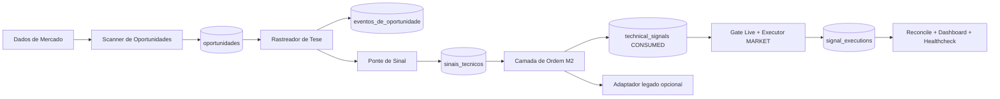

# Arquitetura Alvo - Modelo 2.0

## Visao geral

O Modelo 2.0 separa a decisao em etapas simples,
com responsabilidade clara por camada.

## Camadas

## Camada 1 - Scanner de Oportunidades

Responsavel por detectar padroes tecnicos e registrar `OPORTUNIDADE_IDENTIFICADA`.

Entradas:

1. OHLCV por periodo.
2. Indicadores tecnicos.
3. Estruturas SMC.

Saida:

1. Oportunidade com tese inicial.

## Camada 2 - Rastreador de Tese

Responsavel por acompanhar a oportunidade em novas velas.

Entradas:

1. Oportunidades abertas.
2. Novos dados de mercado.

Saida:

1. Atualizacao de estado: MONITORANDO, VALIDADA, INVALIDADA, EXPIRADA.

## Camada 3 - Ponte de Sinal

Responsavel por converter tese validada em sinal tecnico padronizado.

Entradas:

1. Oportunidades VALIDADAS.

Saida:

1. Sinal pronto para consumo da camada de execucao futura.
2. Persistencia em `technical_signals` no banco canonico `db/modelo2.db`.

## Camada 4 - Camada de Ordem M2 (admissao)

Responsavel por consumir `technical_signals.status = CREATED` e registrar a
decisao de admissao em `technical_signals.status = CONSUMED|CANCELLED`.

Na Fase 2, esta camada continua sem ser o ciclo de vida real da ordem.
Ela apenas entrega sinais admitidos para a execucao nativa do M2.

## Camada 5 - Execucao Real Nativa (M2-009/M2-010/M2-011/M2-012)

Responsavel por transformar sinais admitidos em execucao live/shadow nativa,
sem depender do `trade_signals` legado no caminho critico.

Subcamadas:

1. Gate live: cria `signal_executions` em `READY` ou `BLOCKED`.
2. Executor de entrada: envia ordem `MARKET` e registra `ENTRY_SENT|ENTRY_FILLED`.
3. Fail-safe de protecao: arma `STOP_MARKET` e `TAKE_PROFIT_MARKET`; se falhar,
   fecha a posicao e encerra em `FAILED`.
4. Reconciliador: recupera fill, reconstroi protecao ausente e detecta saida
   manual/externa em `EXITED`.
5. Observabilidade live: publica dashboard, healthcheck e snapshots do ciclo.

Persistencia dedicada:

1. `signal_executions`
2. `signal_execution_events`
3. `signal_execution_snapshots`

## Camada 5.1 - Adaptador de Compatibilidade (M2-007.2)

Converte sinais consumidos de `technical_signals` para `trade_signals` legado
em dual-write controlado.

Na Fase 2, esta compatibilidade fica fora do caminho critico do live e pode
rodar de forma opcional/assincrona.

## Camada transversal - Observabilidade e Qualidade (M2-004/M2-005)

Responsavel por visibilidade operacional e replay historico.

Entradas:

1. `opportunities` e `opportunity_events`.
2. OHLCV historico para replay deterministico.

Saida:

1. Snapshots de painel em `opportunity_dashboard_snapshots`.
2. Snapshots de auditoria em `opportunity_audit_snapshots`.
3. Snapshots live em `signal_execution_snapshots`.
3. Resumos operacionais em `results/model2/runtime/`:
   `model2_dashboard_*.json`, `model2_audit_*.json` e
   `model2_reprocess_*.json`, `model2_bridge_*.json` e
   `model2_export_dashboard_*.json`, `model2_daily_pipeline_*.json` e
   `model2_daily_schedule_*.json`, `model2_daily_healthcheck_*.json`,
   `model2_live_execute_*.json`, `model2_live_reconcile_*.json`,
   `model2_live_dashboard_*.json`, `model2_live_healthcheck_*.json` e
   `model2_live_cycle_*.json`.

## Fluxo principal

1. Scheduler diario (`scripts/model2/schedule_daily_pipeline.py`) dispara o pipeline com lock single-run e retry.
2. Pipeline diario (`scripts/model2/daily_pipeline.py`) orquestra etapas em sequencia fixa.
3. Scanner identifica oportunidade.
4. Rastreador acompanha.
5. Rastreador finaliza em estado final.
6. Ponte publica sinal somente se estado for VALIDADA.
7. Camada de ordem consome sinais `CREATED` e registra `CONSUMED|CANCELLED`.
8. `scripts/model2/live_execute.py` cria `signal_executions` e executa o caminho
   `READY -> ENTRY_SENT -> ENTRY_FILLED -> PROTECTED` quando `execution_mode=live`.
9. `scripts/model2/live_reconcile.py` reconcilia execucoes em aberto e detecta
   saida manual/externa.
10. `scripts/model2/live_dashboard.py` materializa backlog, falhas e latencias do ciclo live.
11. `scripts/model2/healthcheck_live_execution.py` alerta quando o live sair do envelope operacional.
12. `scripts/model2/live_cycle.py` separa o caminho critico live do adaptador legado.
13. `scripts/model2/export_signals.py` continua existindo apenas para compatibilidade legada.
14. Healthcheck diario (`scripts/model2/healthcheck_daily_schedule.py`) continua cobrindo o pipeline diario.

## Requisitos nao funcionais

1. Auditoria completa de transicoes.
2. Idempotencia por ciclo.
3. Reprocessamento historico sem efeitos colaterais (DB de replay isolado).
4. Baixo acoplamento entre camadas.
5. Retencao de snapshots de observabilidade por 30 dias.
6. No maximo uma execucao live ativa por simbolo.
7. Protecao obrigatoria antes de considerar a posicao saudavel.

## Diagrama de alto nivel

