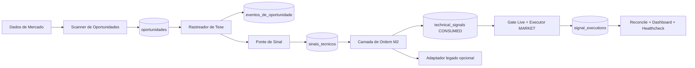

# Arquitetura Alvo - Modelo 2.0

**Status:** COMPLETA (14 MAR 2026)
**Versao:** M2-016.3 (RL Signal Generation + Feature Enrichment + LSTM Prep operacionais)

## Visao geral

O Modelo 2.0 separa a decisao em etapas simples,
com responsabilidade clara por camada. Fase 1 (deterministica) e Fase 2 (execucao nativa) estao operacionais.

## Banco de dados do M2 (contrato operacional)

1. Banco canonico do M2: `MODEL2_DB_PATH` (default: `db/modelo2.db`).
2. O path de `MODEL2_DB_PATH` deve ter permissao de leitura e escrita para:
   `migrate.py`, `live_execute.py`, `live_reconcile.py`, `live_dashboard.py`
   e `healthcheck_live_execution.py`.
3. O schema oficial do M2 e versionado por migracoes em
   `scripts/model2/migrations/*.sql`, aplicado por
   `python scripts/model2/migrate.py up`.
4. O banco legado (`db/crypto_agent.db`) permanece separado do banco canonico
   do M2 para evitar acoplamento de schema e efeitos colaterais operacionais.

## Camadas

## Camada 1 - Scanner de Oportunidades

Responsavel por detectar padroes tecnicos e registrar `OPORTUNIDADE_IDENTIFICADA`.

Entradas:

1. OHLCV por periodo.
2. Indicadores tecnicos.
3. Estruturas SMC.

Saida:

1. Oportunidade com tese inicial.

## Camada 2 - Rastreador de Tese

Responsavel por acompanhar a oportunidade em novas velas.

Entradas:

1. Oportunidades abertas.
2. Novos dados de mercado.

Saida:

1. Atualizacao de estado: MONITORANDO, VALIDADA, INVALIDADA, EXPIRADA.

## Camada 3 - Ponte de Sinal

Responsavel por converter tese validada em sinal tecnico padronizado.

Entradas:

1. Oportunidades VALIDADAS.

Saida:

1. Sinal pronto para consumo da camada de execucao futura.
2. Persistencia em `technical_signals` no banco canonico `db/modelo2.db`.

## Camada 4 - Camada de Ordem M2 (admissao)

Responsavel por consumir `technical_signals.status = CREATED` e registrar a
decisao de admissao em `technical_signals.status = CONSUMED|CANCELLED`.

Na Fase 2, esta camada continua sem ser o ciclo de vida real da ordem.
Ela apenas entrega sinais admitidos para a execucao nativa do M2.

## Camada 5 - Execucao Real Nativa (M2-009/M2-010/M2-011/M2-012)

Responsavel por transformar sinais admitidos em execucao live/shadow nativa,
sem depender do `trade_signals` legado no caminho critico.

Subcamadas:

1. Gate live: cria `signal_executions` em `READY` ou `BLOCKED`.
2. Executor de entrada: envia ordem `MARKET` e registra `ENTRY_SENT|ENTRY_FILLED`.
3. Fail-safe de protecao: arma `STOP_MARKET` e `TAKE_PROFIT_MARKET`; se falhar,
   fecha a posicao e encerra em `FAILED`.
4. Reconciliador: recupera fill, reconstroi protecao ausente e detecta saida
   manual/externa em `EXITED`.
5. Observabilidade live: publica dashboard, healthcheck e snapshots do ciclo.

Persistencia dedicada:

1. `signal_executions`
2. `signal_execution_events`
3. `signal_execution_snapshots`

## Camada 5.1 - Adaptador de Compatibilidade (M2-007.2)

Converte sinais consumidos de `technical_signals` para `trade_signals` legado
em dual-write controlado.

Na Fase 2, esta compatibilidade fica fora do caminho critico do live e pode
rodar de forma opcional/assincrona.

## Camada transversal - Observabilidade e Qualidade (M2-004/M2-005)

Responsavel por visibilidade operacional e replay historico.

Entradas:

1. `opportunities` e `opportunity_events`.
2. OHLCV historico para replay deterministico.

Saida:

1. Snapshots de painel em `opportunity_dashboard_snapshots`.
2. Snapshots de auditoria em `opportunity_audit_snapshots`.
3. Snapshots live em `signal_execution_snapshots`.
4. Resumos operacionais em `results/model2/runtime/`:
   `model2_dashboard_*.json`, `model2_audit_*.json`, `model2_reprocess_*.json`,
   `model2_bridge_*.json`, `model2_export_dashboard_*.json`,
   `model2_daily_pipeline_*.json`, `model2_daily_schedule_*.json`,
   `model2_daily_healthcheck_*.json`, `model2_live_execute_*.json`,
   `model2_live_reconcile_*.json`, `model2_live_dashboard_*.json`,
   `model2_live_healthcheck_*.json` e `model2_go_live_preflight_*.json`.

## Camada transversal - Enriquecimento de Features e ML (M2-016 Fases D-E)

Responsavel por enriquecer episodios de treinamento com dados de mercado externo
(taxas de financiamento, interesse aberto) e preparar estado temporal para
politicas LSTM.

Fases e componentes:

**Fase D.1 - D.3: Coleta e Integracao de Features**
- Daemon de coleta (D.2): `scripts/model2/daemon_funding_rates.py` coleta taxa
  de financiamento pela API Binance em tempo real.
- Features de FR: `latest_rate`, `avg_rate_24h`, sentimento, tendencia.
- Features de OI: interesse aberto normalizado, sentimento, direcao de mudanca.
- Integracao em episodios (D.3): `agent/environment.py` enriquece
  `training_episodes` com features de FR/OI durante coleta de teses.

**Fase D.4: Analise de Correlacao**
- Descobre correlacoes entre sentimento de FR e performance de RL.
- Resultado: FR bearish prediz 0% win rate (sinal forte de perda).
- FR sentiment weak but significant (Pearson r=0.27, p=0.006).
- Saida: `phase_d4_correlation_analysis.py` gera JSON com recomendacoes
  de ajuste de reward.

**Fase E.1: Preparacao de Ambiente LSTM**
- `agent/lstm_environment.py` envolve `SignalReplayEnv` com buffer
  temporal (rolling window de 10 timesteps).
- Extrai 20 features escalares: candles (5), volatilidade (4), multi-TF (3),
  FR (4), OI (3), padding (1).
- Modo dual: retorna (seq_len=10, n_features=20) para LSTM ou
  (seq_len*n_features,)=(200,) para fallback MLP.
- Sincronizacao com D.2/D.3: consome features de funding/OI enriquecidas
  em episodios.

Persistencia dedicada:

1. `funding_rates_api` - Taxa de financiamento historica.
2. Open interest em `training_episodes.oi_*` (sentimento, current, change).
3. Features normalizadas em `training_episodes.features_json`.
4. Analise de correlacao em `results/model2/analysis/phase_d4_correlation_*.json`.

Roadmap LSTM (Fases E.2-E.4):

- E.2: Política LSTM (`CustomLSTMFeaturesExtractor` + `LSTMPolicy`) [CONCLUÍDA].
- E.3: Treinamento PPO LSTM vs MLP (`train_ppo_lstm.py`) [CONCLUÍDA].
- E.4: Análise comparativa e recomendação final (Sharpe delta) [PENDENTE].

Criterios de sucesso:

- Sharpe ratio LSTM >= baseline MLP (idealmente +5%).
- Todas 20 features sem NaN, normalizadas em [-1, 1].
- Taxa de treino >= 500 episodes/dia.

## Fluxo principal

1. Scheduler diario (`scripts/model2/schedule_daily_pipeline.py`) dispara o pipeline com lock single-run e retry.
2. Pipeline diario (`scripts/model2/daily_pipeline.py`) orquestra etapas em sequencia fixa.
3. Scanner identifica oportunidade.
4. Rastreador acompanha.
5. Rastreador finaliza em estado final.
6. Ponte publica sinal somente se estado for VALIDADA.
7. Camada de ordem consome sinais `CREATED` e registra `CONSUMED|CANCELLED`.
8. `scripts/model2/live_execute.py` cria `signal_executions` e executa o caminho
   `READY -> ENTRY_SENT -> ENTRY_FILLED -> PROTECTED` quando `execution_mode=live`.
9. `scripts/model2/live_reconcile.py` reconcilia execucoes em aberto e detecta
   saida manual/externa.
10. `scripts/model2/live_dashboard.py` materializa backlog, falhas e latencias do ciclo live.
11. `scripts/model2/healthcheck_live_execution.py` alerta quando o live sair do envelope operacional.
12. `scripts/model2/live_cycle.py` separa o caminho critico live do adaptador legado.
13. `scripts/model2/export_signals.py` continua existindo apenas para compatibilidade legada.
14. Healthcheck diario (`scripts/model2/healthcheck_daily_schedule.py`) continua cobrindo o pipeline diario.

## Requisitos nao funcionais

1. Auditoria completa de transicoes.
2. Idempotencia por ciclo.
3. Reprocessamento historico sem efeitos colaterais (DB de replay isolado).
4. Baixo acoplamento entre camadas.
5. Retencao de snapshots de observabilidade por 30 dias.
6. No maximo uma execucao live ativa por simbolo.
7. Protecao obrigatoria antes de considerar a posicao saudavel.

## Diagrama de alto nivel

## Entrada operacional unificada (estado atual)

Em ambiente Windows, a operacao local usa `iniciar.bat` como entry point unico.

1. Opcao `1`: fluxo legado (`menu.py`).
2. Opcao `2`: fluxo M2 em loop continuo, executando em cada iteracao:
   - `scripts/model2/daily_pipeline.py`
   - `scripts/model2/live_cycle.py`
   - `scripts/model2/healthcheck_live_execution.py`
3. O intervalo do loop e configuravel por `M2_LOOP_SECONDS` (default `300`).
4. `M2_RUN_ONCE=1` executa um unico ciclo para diagnostico operacional.

## Atualizacao operacional 2026-03-14 (coleta por ciclo + episodios)

No fluxo local Windows (`iniciar.bat`, opcao `2`), o ciclo operacional vigente e:

1. `scripts/model2/sync_market_context.py --timeframe H4`
2. `scripts/model2/sync_market_context.py --timeframe M5`
3. `scripts/model2/daily_pipeline.py --timeframe H4`
4. `scripts/model2/live_cycle.py --timeframe H4`
5. `scripts/model2/persist_training_episodes.py --timeframe H4`
6. `scripts/model2/healthcheck_live_execution.py`

Regras arquiteturais:

1. `sync_market_context` coleta para `M2_SYMBOLS`.
2. `M2_SYMBOLS` governa coleta, pipeline e admissao/execucao live.
3. `M2_LIVE_SYMBOLS` no `.env` define `M2_SYMBOLS` (com fallback para `ALL_SYMBOLS`).
4. Duplicidade de candle e bloqueada por (`symbol`, `timestamp`) no sync.

Novos artefatos operacionais em `results/model2/runtime/`:

1. `model2_market_context_*.json`
2. `model2_training_episodes_*.json`
3. `model2_training_episodes_*.jsonl`
4. `model2_training_episodes_cursor.json`
