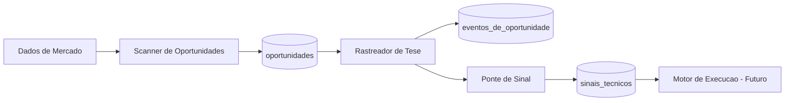

# Arquitetura Alvo - Modelo 2.0

## Visao geral

O Modelo 2.0 separa a decisao em etapas simples,
com responsabilidade clara por camada.

## Camadas

## Camada 1 - Scanner de Oportunidades

Responsavel por detectar padroes tecnicos e registrar `OPORTUNIDADE_IDENTIFICADA`.

Entradas:

1. OHLCV por periodo.
2. Indicadores tecnicos.
3. Estruturas SMC.

Saida:

1. Oportunidade com tese inicial.

## Camada 2 - Rastreador de Tese

Responsavel por acompanhar a oportunidade em novas velas.

Entradas:

1. Oportunidades abertas.
2. Novos dados de mercado.

Saida:

1. Atualizacao de estado: MONITORANDO, VALIDADA, INVALIDADA, EXPIRADA.

## Camada 3 - Ponte de Sinal

Responsavel por converter tese validada em sinal tecnico padronizado.

Entradas:

1. Oportunidades VALIDADAS.

Saida:

1. Sinal pronto para consumo da camada de execucao futura.

## Camada 4 - Motor de Execucao (futuro)

Fora do escopo da Fase 1.

## Fluxo principal

1. Scanner identifica oportunidade.
2. Rastreador acompanha.
3. Rastreador finaliza em estado final.
4. Ponte publica sinal somente se estado for VALIDADA.

## Requisitos nao funcionais

1. Auditoria completa de transicoes.
2. Idempotencia por ciclo.
3. Reprocessamento historico sem efeitos colaterais.
4. Baixo acoplamento entre camadas.

## Diagrama de alto nivel

