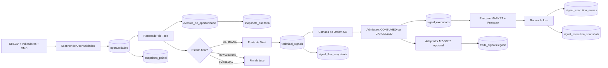
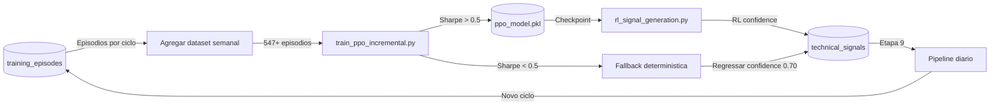
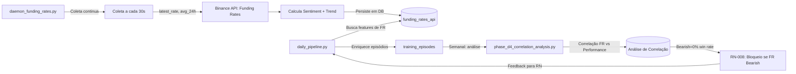
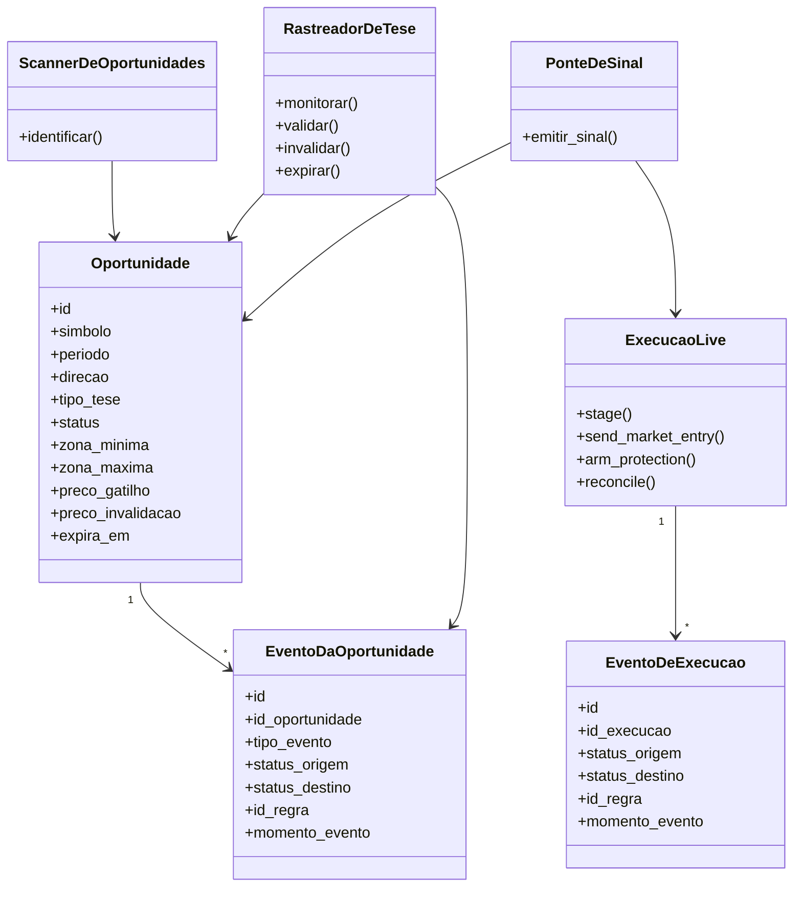
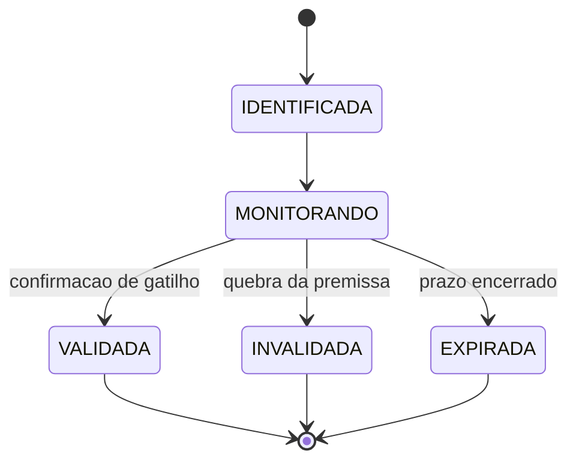
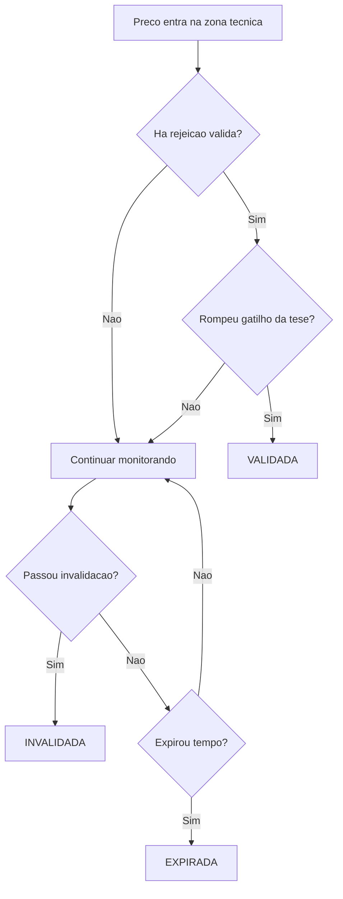
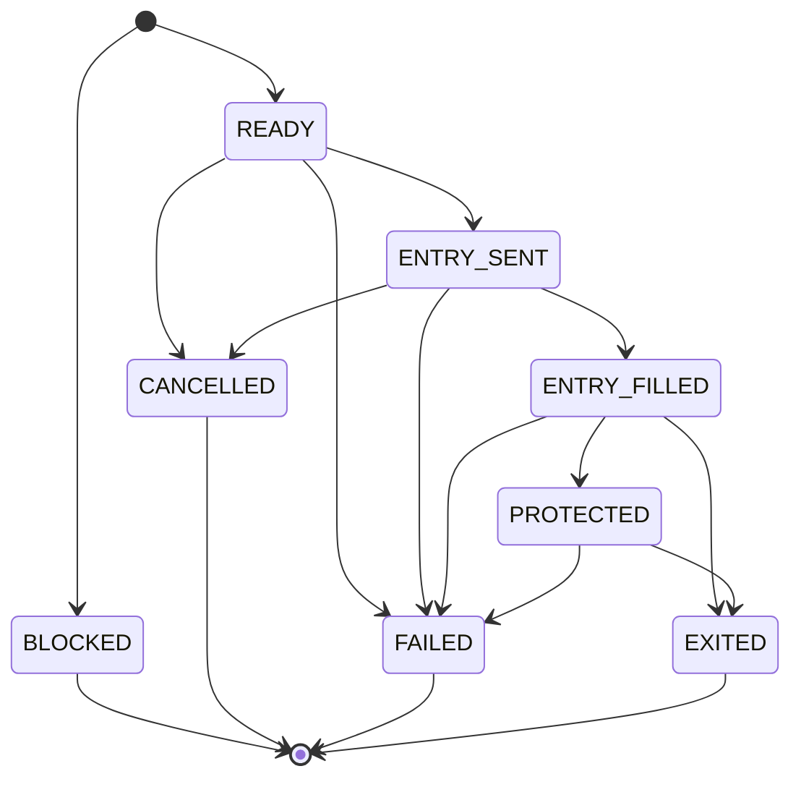
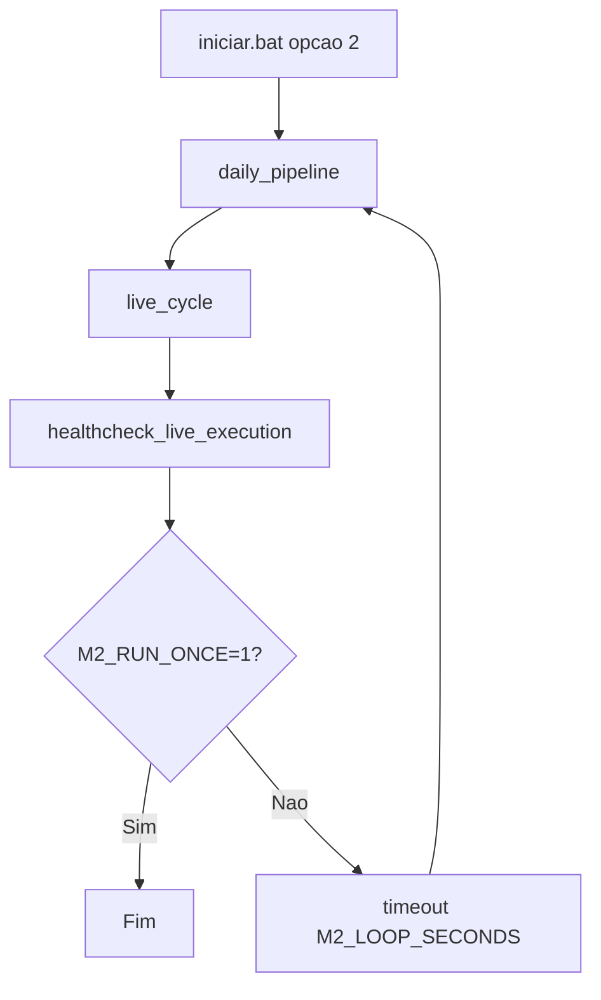
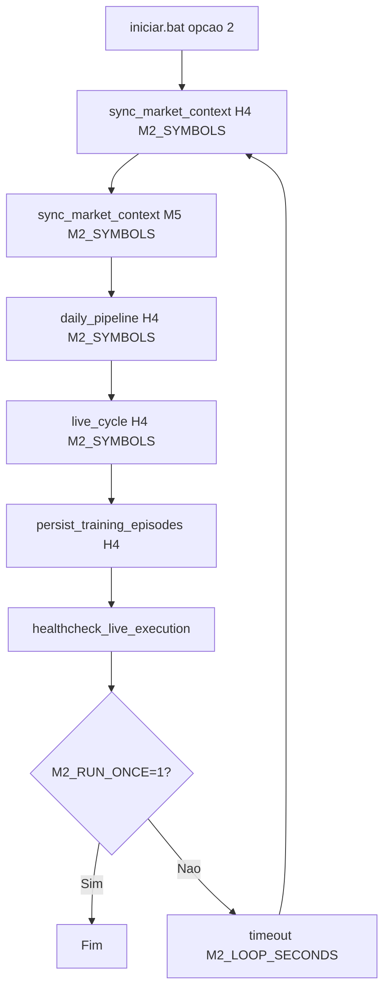

# Diagramas - Modelo 2.0

## 1) Fluxo de dados

Runner operacional ponta a ponta: `scripts/model2/daily_pipeline.py`.
Runner operacional agendado: `scripts/model2/schedule_daily_pipeline.py`.
Runner de healthcheck: `scripts/model2/healthcheck_daily_schedule.py`.
Runner operacional da ponte: `scripts/model2/bridge.py`.
Runners do live: `scripts/model2/live_execute.py`,
`scripts/model2/live_reconcile.py`, `scripts/model2/live_dashboard.py` e
`scripts/model2/live_cycle.py`.

## 1b) Fluxo de Treinamento e RL (M2-015.3)

Execução semanal, fora do caminho crítico do pipeline diário:

**Notas:**

- Coleta de episodios é automática em cada ciclo do `daily_pipeline.py`
- Treinamento PPO roda off-pipeline (semanal)
- RL enhancement só ativa se modelo passar limiares de qualidade
- Auditoria completa de qual modelo foi usado (deterministica vs RL)

## 1c) Fluxo de Enriquecimento de Features (Fases D.2-D.4)

Daemon de coleta contínua de dados de mercado externos:

**Componentes:**

- `daemon_funding_rates.py`: Coleta em background (PID persistente)
- `funding_rates_api`: Tabela com fr_sentiment, fr_trend, timestamp
- `phase_d4_correlation_analysis.py`: Pearson r, p-value, win_rate por sentiment
- **Descoberta**: FR Bearish → 0% win rate (sinal forte de rejeição)
- **Resultado**: RN-008 implementada (bloqueio de sinais em FR bearish)

## 1d) Fluxo de Preparação e Treino LSTM (Fases E.1-E.3)

Transformação de estado flat → temporal para políticas LSTM e rotina
de treinamento:

```mermaid
flowchart LR
    A[SignalReplayEnv]
    B[Observação flat n_features]
    C[LSTMSignalEnvironment]
    D[Rolling Buffer deque maxlen=10]
    E[22 Features Extracted]
    F[Normalização -1 a 1]
    G[Shape: 10x22]
    H[LSTM Policy]
    I[Fallback MLP: 220,]
    J[Treinamento PPO]
    K[Comparação Sharpe]
    
    A --> B
    B -->|reset/step| C
    C -->|Buffer temporal| D
    D -->|5 candle, 4 vol, 3 MACD, 3 TF, 4 FR, 3 OI| E
    E --> F
    F --> G
    G -->|CustomLSTMFeaturesExtractor| H
    G -->|Fallback| I
    H --> J
    I --> J
    J --> K
    K -->|Meta: +5% vs MLP| H
```

**Componentes:**

- `agent/lstm_environment.py`: Wrapper com state buffer (Fase E.1)
- `agent/lstm_policy.py`: Custom LSTM features extractor + Policy Network
  (Fase E.2)
- `scripts/model2/train_ppo_lstm.py`: Pipeline comparativo PPO (Fase E.3)
- 22 features escalares: OHLCV, volatilidade, MACD, multi-TF, FR, OI
- Modo dual garantindo integração com arquiteturas SB3
- Roadmap restante (E.4): Análise comparativa (Pendente)
- **Meta**: Sharpe ratio LSTM >= baseline MLP (+5% ideal)

## 2) Diagrama de classes

## 3) Fluxo da tese

## 4) Decisao do modelo (fase 1)

## 5) Ciclo de execucao live (fase 2)

## 6) Loop operacional unificado (Windows)

Entry point local: `iniciar.bat` (opcao `2`).

## 7) Loop operacional unificado (Windows) - estado atual

Entry point local: `iniciar.bat` (opcao `2`).

Regra de deduplicacao:

1. `sync_market_context` nao persiste candle repetido com mesmo
   `symbol+timestamp`.
