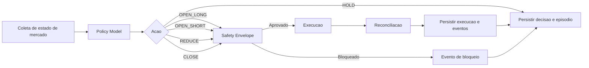
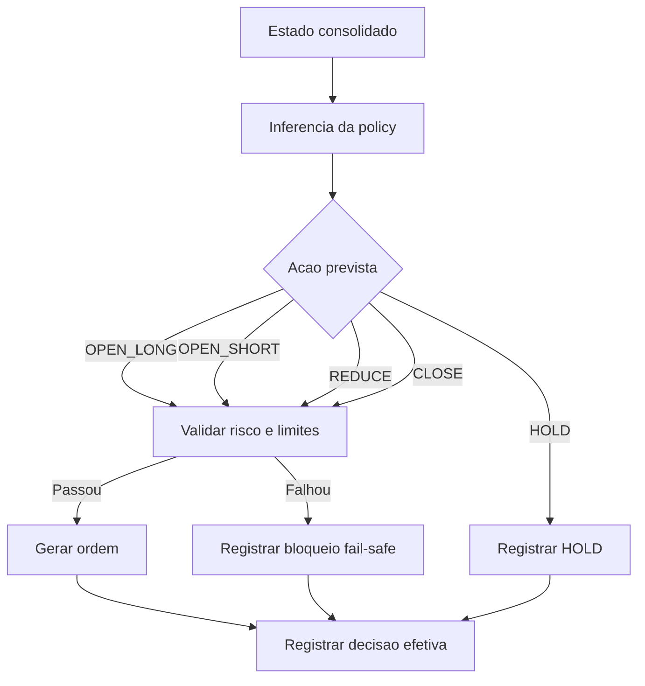
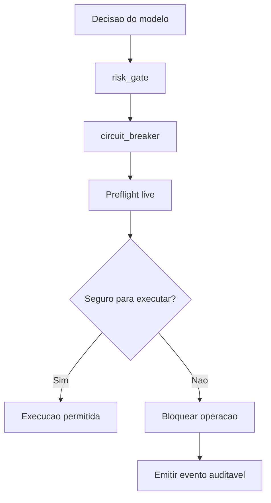
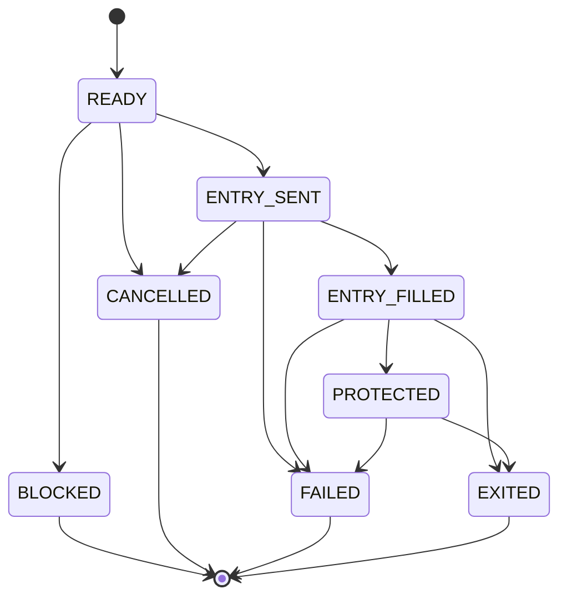
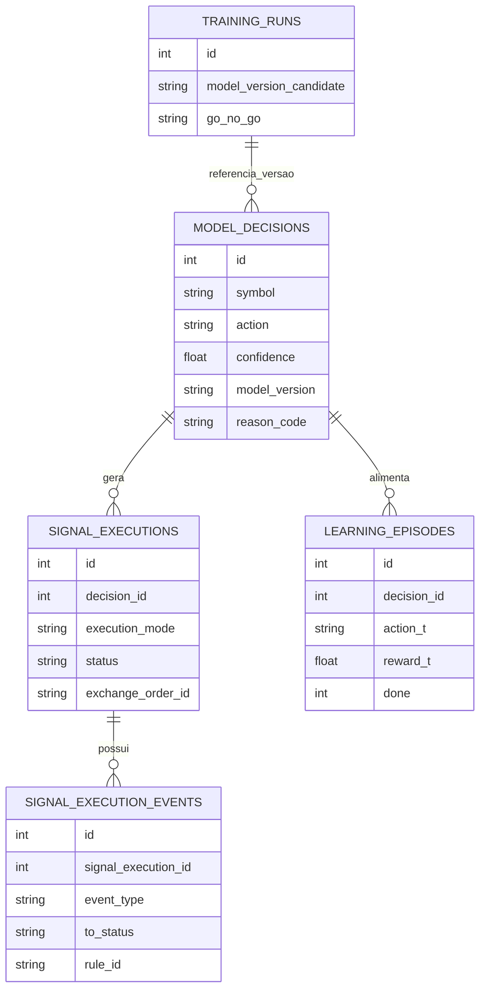
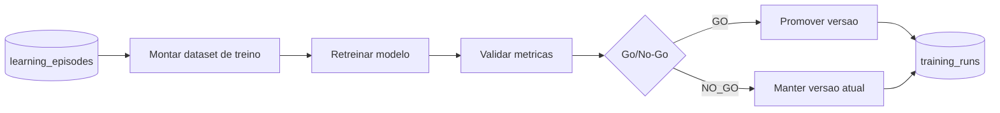
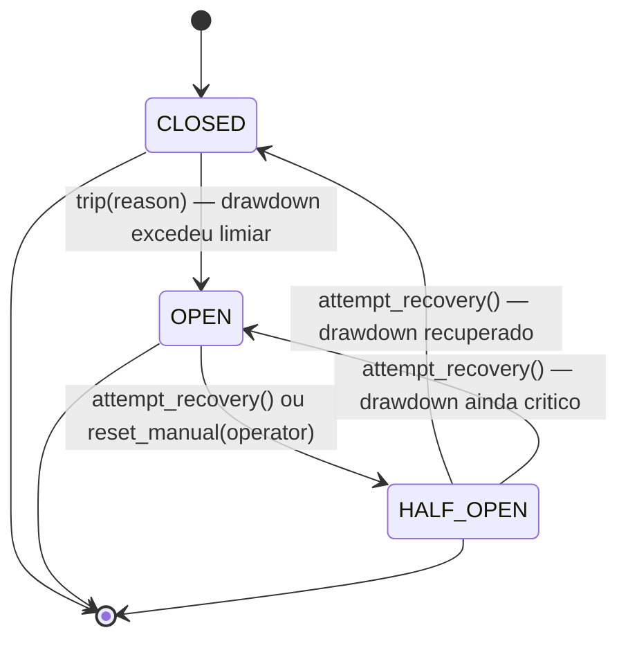
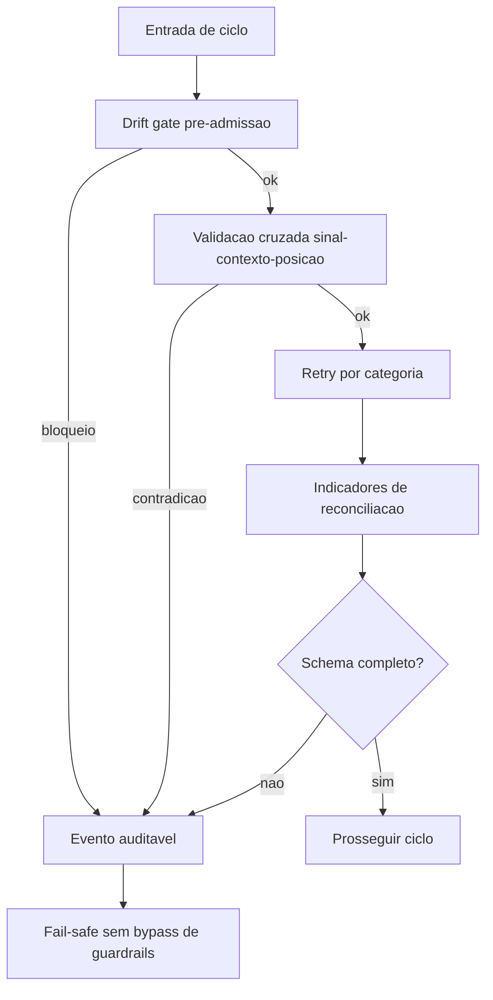

# Diagramas - Modelo 2.0 (Estado Atual)

## 1) Fluxo ponta a ponta (model-driven)

Fluxo operacional de referencia para execucao diaria e live.

## 2) Fluxo de decisao do modelo

A decisao nasce exclusivamente no modelo e segue para seguranca.

## 3) Safety envelope e fail-safe

Guard-rails obrigatorios em todo caminho live.

## 4) Ciclo de execucao e reconciliacao

Estados operacionais de execucao no live.

## 5) Entidades e relacoes de dados

Representacao logica das entidades do estado atual.

## 6) Aprendizado continuo e promocao

Fluxo de retreino governado fora do runtime live.

## 7) Loop operacional unificado (Windows)

Entry point local: `iniciar.bat` (opcao `2`).

Regra de deduplicacao:

1. `sync_market_context` nao persiste candle repetido com mesmo
   `symbol+timestamp`.

## 8) Maquina de estados do Circuit Breaker (BLID-092)

Estados e transicoes do `risk/circuit_breaker.py`.

Aliases em `risk/states.py`: `NORMAL = CLOSED`, `TRANCADO = OPEN`.

Toda transicao gera `CircuitBreakerTransition` (frozen dataclass) com
`from_state`, `to_state`, `reason`, `timestamp_utc`.

## 9) Referencias canonicas

1. `docs/ARQUITETURA_ALVO.md`
2. `docs/REGRAS_DE_NEGOCIO.md`
3. `docs/MODELAGEM_DE_DADOS.md`

## 10) Controles de resiliencia contratuais (PKG-PO10-0326)

