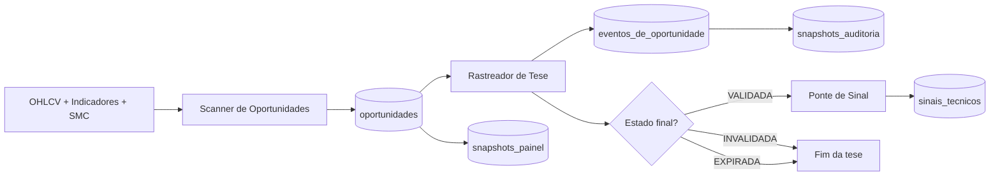
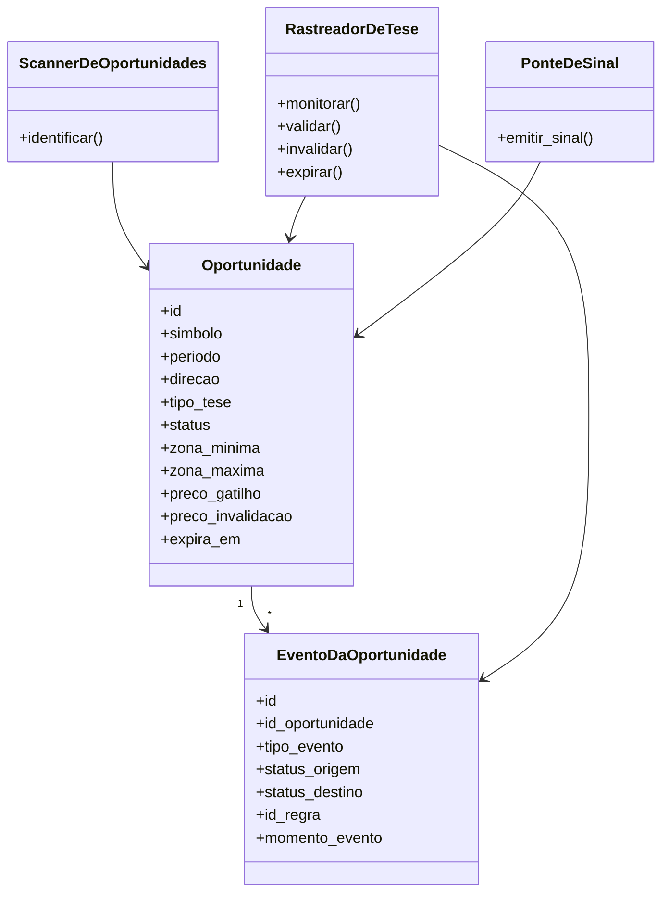
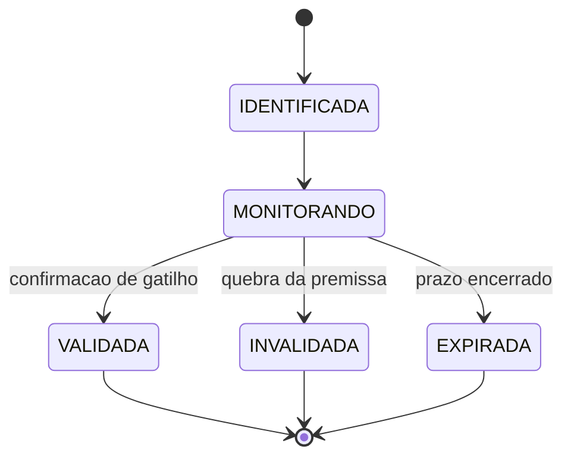
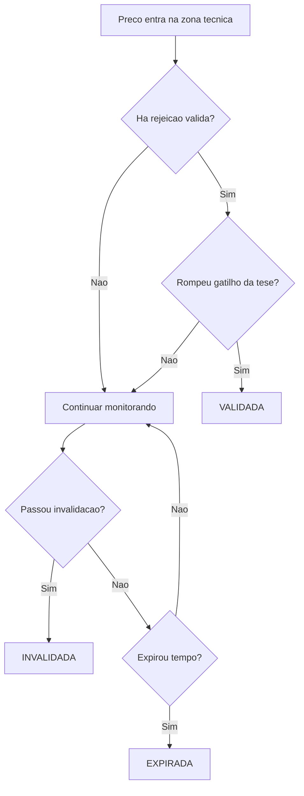

# Diagramas - Modelo 2.0

## 1) Fluxo de dados

```mermaid
flowchart LR
    A[OHLCV + Indicadores + SMC] --> B[Scanner de Oportunidades]
    B --> C[(oportunidades)]
    C --> D[Rastreador de Tese]
    D --> E[(eventos_de_oportunidade)]
    E --> J[(snapshots_auditoria)]
    D --> F{Estado final?}
    F -->|VALIDADA| G[Ponte de Sinal]
    F -->|INVALIDADA| H[Fim da tese]
    F -->|EXPIRADA| H
    C --> K[(snapshots_painel)]
    G --> I[(sinais_tecnicos)]
```

## 2) Diagrama de classes

```mermaid
classDiagram
    class Oportunidade {
      +id
      +simbolo
      +periodo
      +direcao
      +tipo_tese
      +status
      +zona_minima
      +zona_maxima
      +preco_gatilho
      +preco_invalidacao
      +expira_em
    }

    class EventoDaOportunidade {
      +id
      +id_oportunidade
      +tipo_evento
      +status_origem
      +status_destino
      +id_regra
      +momento_evento
    }

    class ScannerDeOportunidades {
      +identificar()
    }

    class RastreadorDeTese {
      +monitorar()
      +validar()
      +invalidar()
      +expirar()
    }

    class PonteDeSinal {
      +emitir_sinal()
    }

    Oportunidade "1" --> "*" EventoDaOportunidade
    ScannerDeOportunidades --> Oportunidade
    RastreadorDeTese --> Oportunidade
    RastreadorDeTese --> EventoDaOportunidade
    PonteDeSinal --> Oportunidade
```

## 3) Fluxo da tese

```mermaid
stateDiagram-v2
    [*] --> IDENTIFICADA
    IDENTIFICADA --> MONITORANDO
    MONITORANDO --> VALIDADA: confirmacao de gatilho
    MONITORANDO --> INVALIDADA: quebra da premissa
    MONITORANDO --> EXPIRADA: prazo encerrado
    VALIDADA --> [*]
    INVALIDADA --> [*]
    EXPIRADA --> [*]
```

## 4) Decisao do modelo (fase 1)

```mermaid
flowchart TD
    A[Preco entra na zona tecnica] --> B{Ha rejeicao valida?}
    B -->|Nao| C[Continuar monitorando]
    B -->|Sim| D{Rompeu gatilho da tese?}
    D -->|Nao| C
    D -->|Sim| E[VALIDADA]
    C --> F{Passou invalidacao?}
    F -->|Sim| G[INVALIDADA]
    F -->|Nao| H{Expirou tempo?}
    H -->|Sim| I[EXPIRADA]
    H -->|Nao| C
```
